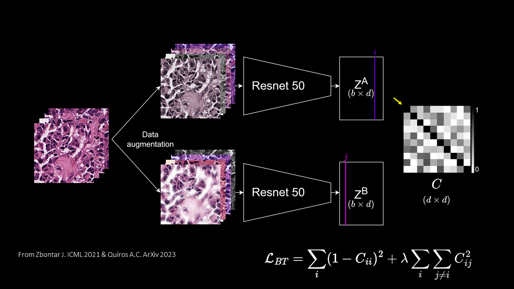

# Barlow Twins for Lung Neuroendocrine Neoplasms: 
Unsupervised deep learning model trained to extract features from images. The adaptation we propose here is dedicated to learning the features of the tiles making up whole slide images of Lung Neuroendocrine Neoplasms (LNENs). The encoded vectors created by the Barlow twins of tiles sharing common pathological features are assumed to be closer in latent space than less similar tiles, as demonstrated for the first time by [A. Quiros and colleagues](https://arxiv.org/abs/2205.01931).

- Original article: J. Zbontar [Barlow Twins](https://proceedings.mlr.press/v139/zbontar21a.html), PMLR 2021.
- Original code: [https://github.com/facebookresearch/barlowtwins](https://github.com/facebookresearch/barlowtwins)
- Method used to extract features from WSIs stained with haematoxylin and eosin (HE) to distinguish typical from atypical carcinoids in "Assessment of the current and emerging criteria for the histopathological classification of lung neuroendocrine tumours in the lungNENomics project." ESMO Open 2023 (under review)

## Installation
- Clone this repository: tested on Python 3.9
- Install [PyTorch](http://pytorch.org/): tested on v1.9.0
- Install [Torchvison](https://pytorch.org/vision/stable/index.html) tested on v0.10.0
- Install [cudatoolkit](https://developer.nvidia.com/cuda-toolkit) tested on 10.2.0
- Install [pillow](https://pillow.readthedocs.io/en/stable/)  tested on 9.3.0
- Install any version of numpy
- Other dependencies in environment.yml

Install all packages with this command:
```
$ conda env create -f environment.yml
```

## Dataset
This model was trained on 259 HE-stained  WSIs of LNEN. The WSIs were cut into 384x384 pixel tiles and the colors were normalized using Vahadane's color deconvolution method. Pre-processing scripts are available in  [https://github.com/IARCbioinfo/WSIPreprocessing](https://github.com/IARCbioinfo/WSIPreprocessing). The ~4.1M pre-processed tiles aer available on request from mathiane@iarc.who.int.

## Training Model
- An example of the configurations used to trained Barlow Twins for LNEN WSIs is available in `Bash/Train/TumorNormal/TrainToyDataset.sh`
- The commands below are used to train the model based on the toy data set for a tumor segmentation task running on a single RTX-5000:
```
bash Bash/Train/TrainToyDataset.sh 
```
- The configuration used in our ESMO Open article, i.e. to run the model in parallel on 8 V100s for a training run with a large batch size of 896 HE tiles, is given in `Bash/Train/TrainLNENParallel.sh` 
- **Note:** 
  + Additional configurations and parameters are described at the beginning of `main.py`.
  + Trained network weights are available on request.
  + The data loader relies on a file containing the absolute path to the tiles included in the training dataset (see command line argument `list-dir`).

## Testing Pretrained Models
- An example of the configurations to use the model in inference mode is given in `Bash/Test/TestToyModel.sh`

```
bash Bash/Test/TumorNormal/TestToyModel.sh
```
- This script saves the encoded vector generated by Barlow Twins in a file for each tile in `.npy` format, in the folder specified by the `projector-dir` command line argument.
- **Warning: the `projector` command line argument must be identical to the one defined during training, as it defines the network architecture.**

### Explore Barlow Twins encoded vectors
- We created a small 